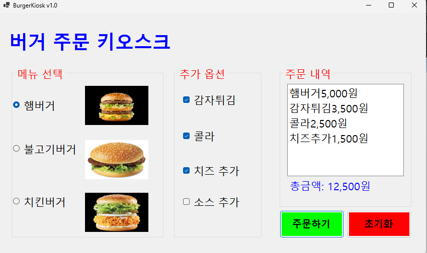
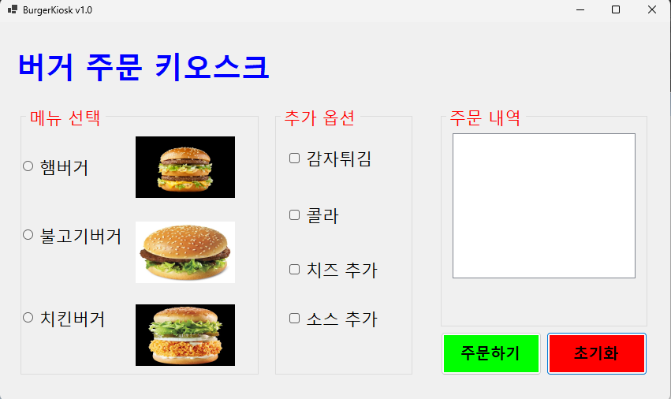
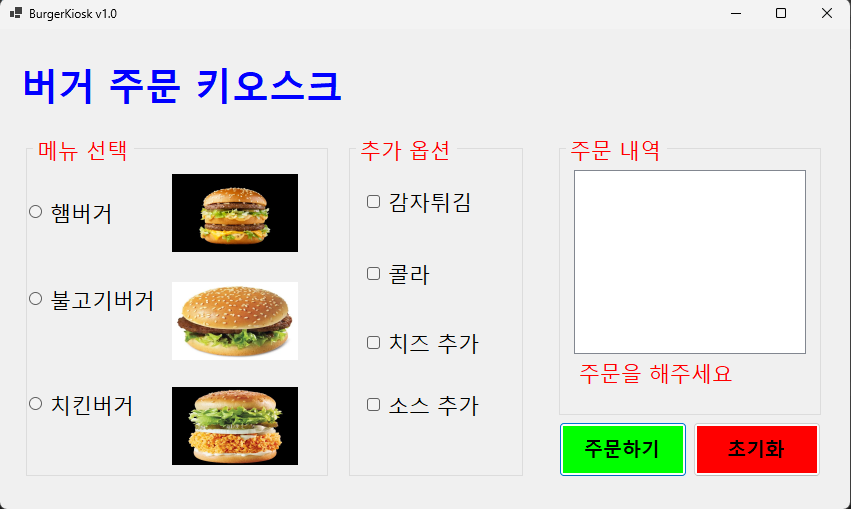
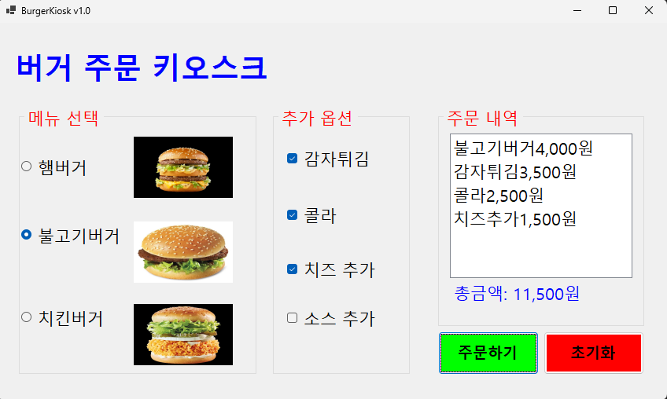

# (C# 코딩) 버거키오스크
## 개요
-C# 프로그래밍학습
-1줄소개: 마우스 클릭을 입력받아서 키오스크처럼 작동하는 프로그램
-사용한플랫폼: -C#, .NET Windows Forms, Visual Studio, GitHub
-사용한컨트롤:-Label, TextBox, ListBox, Button, radioButton, CheckBox
-사용한기술과구현한기능:
-Visual Studio를이용하여UI 디자인
-radioButton과CheckBox를이용한옵션선택
-button클릭이벤트를이용한주문처리

## 실행화면
-코드의실행스크린샷과구현내용설명
-
-
-구현한내용(위그림참조)
-메인화면:버거세트,사이드,음료를선택할수있는옵션과주문하기버튼이존재
-버거:햄버거,치즈버거,불고기버거중하나선택
-추가 옵션:감자튀김,치즈추가,소스추가,콜라 중하나선택
-주문하기버튼:선택한옵션을기반으로주문내용을출력하는기능
-주문내용출력:선택한버거와추가옵션을문자열로조합하여주문내용을출력하는기능
-초기화버튼:모든옵션을초기화하는기능
-radioButton,CheckBox를 이용하여 선택가능하게 함

## 실행화면
-코드의실행스크린샷과구현내용설명
-

-구현한내용(위그림참조)
-아무것도 선택하지 않고 주문하기 클릭시 "주문을 해주세요"라는 메시지가 빨간 글씨로 출력
-메뉴를 다시 선택하고 클릭시 파란글씨로 총 금액이 출력되게 함

## 실행화면
-코드의실행스크린샷과구현내용설명
-

-구현한내용(위그림참조)
-Tab을이용해서GroupBox사이를이동하기
-방향키를이용해서선택아이템사이를이동하기
-스페이스바를이용해서아이템선택하기
-Enter키로버튼을누르기